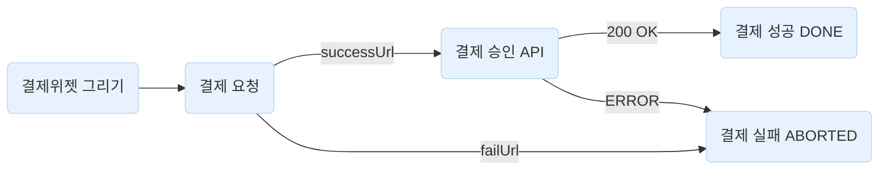
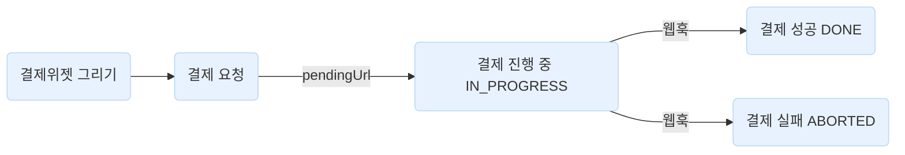
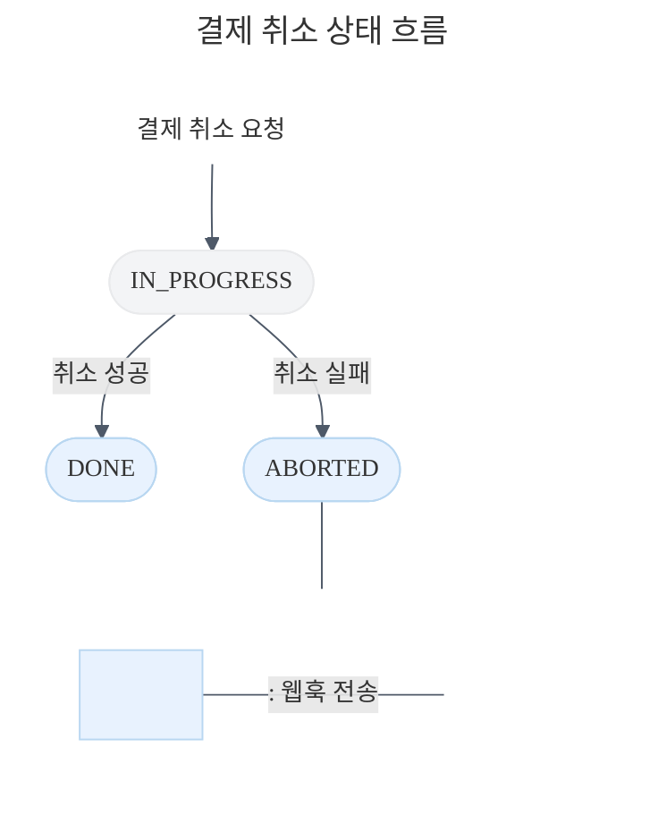

***

title: 해외 간편결제창 연동하기
description: PayPal과 중국 및 동남아 결제를 결제창 SDK로 연동하는 방법입니다.
keyword:
searchIndex: false
------------------

**Version 2**

새로 나온

# 해외 간편결제창 연동하기

{description}

샘플 프로젝트 바로가기

API 실행해보기

해외 간편결제에는 비동기・동기 결제 방법이 있어요. 비동기 연동 방법은 중국 및 동남아(비동기) 결제에 사용됩니다. 동기 연동 방법은 PayPal(동기) 결제에 사용됩니다. 각 방법의 차이점을 먼저 알아보세요.

중국 및 동남아 간편결제(비동기)
PayPal(동기)



**동기 결제**는 클라이언트에서 결제를 요청하면 인증 후 서버에서 결제 승인 API를 호출해요. 결제 요청의 결과를 `successUrl`, `failUrl`에서 확인하고, 결제 승인 결과는 API의 응답에서 확인할 수 있어요.



**비동기 결제**는 클라이언트에서 결제를 요청하면 인증과 승인이 동시에 요청돼요. 결제 요청이 완료되면 `pendingUrl`로 이동해요. 결제 승인 결과는 서버에 연결한 [웹훅](/guides/v2/webhook)으로 확인할 수 있어요. 결제 요청부터 결제 성공・실패까지 최대 10분이 소요됩니다.


title: pendingUrl은 뭔가요?


`pendingUrl`은 Alipay 등 중국 및 동남아(비동기) 결제에서 사용하는 리다이렉트 URL입니다. 중국 및 동남아(비동기) 결제는 결제 요청 이후에 결제가 완료될 때까지 최대 10분이 소요될 수 있어요.

그렇기 때문에 서버에서 `PAYMENT_STATUS_CHANGED` 웹훅을 연동하고 최종 결제 결과를 웹훅으로 받아야 됩니다. `pendingUrl`에서 웹훅 서버를 폴링하고 결제 상태가 확정될 때까지 대기한 후에 구매자에게 안내해주세요.

웹훅 서버를 폴링하기 어렵다면 [`requestPayment()`](/sdk/widget-js#requestpayment결제-정보) 메서드에 `customerEmail` 파라미터를 설정하세요. 결제가 완료되면 구매자에게 안내 메일이 발송됩니다.


title: 결제 요청 결과를 Promise로 받을 수 있나요?


아니요. 해외 간편결제는 `successUrl`, `failUrl`, `pendingUrl` 리다이렉트 URL로 응답을 확인하세요. 구매자가 결제수단 사이트로 이동하기 때문에 [`requestPayment()`](/sdk/widget-js#requestpayment결제-정보) 메서드의 응답을 Promise로 받을 수 없어요.

`successUrl`, `failUrl`은 PayPal(동기) 결제에 사용됩니다. `pendingUrl`은 중국 및 동남아(비동기) 결제에 사용됩니다.


title: 어떤 해외 간편결제 수단을 지원하나요?


| 결제수단            | 코드              | 현지 통화          | 결제 연동 방법 |
| ------------------- | ----------------- | ------------------ | -------------- |
| Alipay              | `ALIPAY`          | CNY                | 비동기         |
| AlipayHK            | `ALIPAYHK`        | HKD                | 비동기         |
| BillEase            | `BILLEASE`        | PHP                | 비동기         |
| Boost               | `BOOST`           | MYR                | 비동기         |
| BPI                 | `BPI`             | PHP                | 비동기         |
| DANA                | `DANA`            | IDR                | 비동기         |
| GCash               | `GCASH`           | PHP                | 비동기         |
| PayPal              | `PAYPAL`/`페이팔` | 구매자의 현지 통화 | 동기           |
| Rabbit LINE Pay     | `RABBIT_LINE_PAY` | THB                | 비동기         |
| Touch 'n Go eWallet | `TOUCHNGO`        | MYR                | 비동기         |
| TrueMoney Wallet    | `TRUEMONEY`       | THB                | 비동기         |

## API 키 준비하기

개발자센터의 [API 키 메뉴](https://developers.tosspayments.com/my/api-keys)에서 **API 개별 연동 키**를 확인하세요.

토스페이먼츠와 전자결제 계약 전이어도 회원가입하면 나만의 테스트 상점 키를 확인하고 테스트 결제내역, 웹훅 등 기능을 사용할 수 있어요. 로그인한 상태라면 코드의 키값이 테스트 상점 키입니다. 로그인하지 않아도 문서 테스트 키로 테스트 연동할 수 있어요.

토스페이먼츠와 전자결제 계약을 완료했다면 개발자센터의 [API 키 메뉴](https://developers.tosspayments.com/my/api-keys)에서 해외 간편결제로 계약된 상점아이디(MID)를 선택한 다음에 클라이언트 키와 시크릿 키를 확인하세요. [테스트 키와 라이브 키의 차이점](/reference/using-api/api-keys#api-키-이해하기)도 확인하고 연동을 시작하세요.

```js title="API 개별 연동 키"
// API 개별 테스트 연동 키
// 토스페이먼츠에 회원가입하기 전이라면 아래 키는 문서 테스트 키입니다.
// 토스페이먼츠에 회원가입하고 로그인한 상태라면 아래 키는 내 테스트 키입니다.
const clientKey = "<ClientKey />";
const secretKey = "<SecretKey />";
```


***

## 1. 결제창 띄우기

먼저 주문서 페이지에 결제창을 연동할게요. 아래 코드는 주문서 페이지의 예시에요.

스크립트 태그 또는 패키지 매니저로 토스페이먼츠 SDK를 설치하고, 클라이언트 키로 SDK를 초기화하세요. 다음, [`payment()`](/sdk/v2/js#tosspaymentspayment) 메서드로 결제창 인스턴스를 생성하세요. 아래 코드에서는 `payment`라는 인스턴스를 생성했어요.

그럼 이제 결제창을 띄울 준비가 됐어요. [`payment.requestPayment()`](/sdk/v2/js#paymentrequestpayment) 메서드를 호출하면 결제 요청이 시작되고, 결제창이 열려요. 메서드의 파라미터로 결제수단(`FOREIGN_EASY_PAY`), 주문번호, 결제금액, `successUrl`, `failUrl`, `pendingUrl` 등 필요한 정보를 설정하세요. 해외 간편결제는 현재 `USD`만 지원하고 있어요.

그리고 주문서의 **'결제하기'** 버튼에 결제 요청 메서드를 이벤트로 등록해주세요.

```html title="주문서 페이지" stack="frontend"
<!DOCTYPE html>
<html lang="ko">
  <head>
    <meta charset="utf-8" />
    <!-- SDK 추가 -->
    <script src="https://js.tosspayments.com/v2/standard"></script>
  </head>

  <body>
    <!-- 주문서 UI -->
    <!-- 결제하기 버튼 -->
    <button class="button" onclick="requestPayment()">결제하기</button>
    <script>
      // ------  SDK 초기화 ------
      // @docs https://docs.tosspayments.com/sdk/v2/js#토스페이먼츠-초기화
      const clientKey = "<ClientKey />";
      const customerKey = "<UniqueId name='customerKey.paypal' />";
      // 회원 결제
      // @docs https://docs.tosspayments.com/sdk/v2/js#tosspaymentspayment
      const tossPayments = TossPayments(clientKey);
      const payment = tossPayments.payment({ customerKey });
      // 비회원 결제
      // const payment = tossPayments.payment({customerKey: TossPayments.ANONYMOUS})

      // ------ '결제하기' 버튼 누르면 결제창 띄우기 ------
      // @docs https://docs.tosspayments.com/sdk/v2/js#paymentrequestpayment
      async function requestPayment() {
        // 결제를 요청하기 전에 orderId, amount를 서버에 저장하세요.
        // 결제 과정에서 악의적으로 결제 금액이 바뀌는 것을 확인하는 용도입니다.
        await payment.requestPayment({
          method: "FOREIGN_EASY_PAY", // 해외 간편결제
          amount: {
            currency: "USD", // 해외 결제는 USD만 지원해요
            value: 50,
          },
          orderId: "<UniqueId name='orderId.paypal' />", // 고유 주문번호
          orderName: "토스 티셔츠 외 2건",
          successUrl: window.location.origin + "/success", // 동기 결제 요청이 성공하면 리다이렉트되는 URL
          failUrl: window.location.origin + "/fail", // 동기 결제 요청이 실패하면 리다이렉트되는 URL
          pendingUrl: window.location.origin + "/pending", // 비동기 결제에서 리다이렉트되는 URL
          customerEmail: "customer123@gmail.com",
          customerName: "김토스",
          customerMobilePhone: "01012341234",
          // 해외 간편결제에 필요한 정보
          foreignEasyPay: {
            provider: "ALIPAY", // 열고 싶은 간편결제사
            country: "CN",
          },
        });
      }
    </script>
  </body>
</html>
```

```jsx title="주문서 페이지" stack="frontend"
import { loadTossPayments, ANONYMOUS } from "@tosspayments/tosspayments-sdk";
import { useEffect, useState } from "react";

// ------  SDK 초기화 ------
// @docs https://docs.tosspayments.com/sdk/v2/js#토스페이먼츠-초기화
const clientKey = "<ClientKey />";
const customerKey = "<UniqueId name='customerKey.card' />";

export function PaymentCheckoutPage() {
  const [payment, setPayment] = useState(null);
  const [amount] = useState({
    currency: "USD", // 해외 결제는 USD만 지원해요
    value: 50,
  });
  const [selectedPaymentMethod, setSelectedPaymentMethod] = useState(null);

  function selectPaymentMethod(method) {
    setSelectedPaymentMethod(method);
  }

  useEffect(() => {
    async function fetchPayment() {
      try {
        const tossPayments = await loadTossPayments(clientKey);

        // 회원 결제
        // @docs https://docs.tosspayments.com/sdk/v2/js#tosspaymentspayment
        const payment = tossPayments.payment({
          customerKey,
        });
        // 비회원 결제
        // const payment = tossPayments.payment({ customerKey: ANONYMOUS });

        setPayment(payment);
      } catch (error) {
        console.error("Error fetching payment:", error);
      }
    }

    fetchPayment();
  }, [clientKey, customerKey]);

  // ------ '결제하기' 버튼 누르면 결제창 띄우기 ------
  // @docs https://docs.tosspayments.com/sdk/v2/js#paymentrequestpayment
  async function requestPayment() {
    // 결제를 요청하기 전에 orderId, amount를 서버에 저장하세요.
    // 결제 과정에서 악의적으로 결제 금액이 바뀌는 것을 확인하는 용도입니다.
    await payment.requestPayment({
      method: "FOREIGN_EASY_PAY", // 해외 간편결제
      amount: amount,
      orderId: "<UniqueId name='orderId.paypal' />", // 고유 주문번호
      orderName: "토스 티셔츠 외 2건",
      successUrl: window.location.origin + "/success", // 동기 결제 요청이 성공하면 리다이렉트되는 URL
      failUrl: window.location.origin + "/fail", // 동기 결제 요청이 실패하면 리다이렉트되는 URL
      pendingUrl: window.location.origin + "/pending", // 비동기 결제에서 리다이렉트되는 URL
      customerEmail: "customer123@gmail.com",
      customerName: "김토스",
      customerMobilePhone: "01012341234",
      // 해외 간편결제에 필요한 정보
      foreignEasyPay: {
        provider: "ALIPAY", // 열고 싶은 간편결제사
        country: "CN",
      },
    });
  }

  return (
    // 결제하기 버튼
    <button className="button" onClick={() => requestPayment()}>
      결제하기
    </button>
  );
}
```


title: 사용 가능한 해외간편결제사(provider)를 확인하세요


해외 간편결제사 코드입니다. 토스페이먼츠에서 지원하는 해외 간편결제사 코드와 특징은 아래 표에서 확인하세요.

| 결제수단            | 코드              | 현지 통화          | 결제 연동 방법 |
| ------------------- | ----------------- | ------------------ | -------------- |
| Alipay              | `ALIPAY`          | CNY                | 비동기         |
| AlipayHK            | `ALIPAYHK`        | HKD                | 비동기         |
| BillEase            | `BILLEASE`        | PHP                | 비동기         |
| Boost               | `BOOST`           | MYR                | 비동기         |
| BPI                 | `BPI`             | PHP                | 비동기         |
| DANA                | `DANA`            | IDR                | 비동기         |
| GCash               | `GCASH`           | PHP                | 비동기         |
| PayPal              | `PAYPAL`/`페이팔` | 구매자의 현지 통화 | 동기           |
| Rabbit LINE Pay     | `RABBIT_LINE_PAY` | THB                | 비동기         |
| Touch 'n Go eWallet | `TOUCHNGO`        | MYR                | 비동기         |
| TrueMoney Wallet    | `TRUEMONEY`       | THB                | 비동기         |


title: 결제창을 띄우기 전에 구매자의 이용약관 동의를 반드시 받으세요


이용약관 동의를 받지 않고 이루어진 결제는 법적으로 유효하지 않을 수 있고, 동의 없이 개인정보를 처리하는 것은 개인정보보호법에 위배될 수 있습니다. 동의 없이 이루어진 거래로 인해 발생한 피해는 높은 배상 책임을 질 수 있습니다.

| 약관                           | 링크                                                                                                                                                   |
| ------------------------------ | ------------------------------------------------------------------------------------------------------------------------------------------------------ |
| 전자결제 이용약관              | - 국문: https://pages.tosspayments.com/terms/user - 영문: https://pages.tosspayments.com/terms/user/en/                                         |
| 개인(신용)정보 수집·이용 동의  | - 국문: https://pages.tosspayments.com/terms/privacy/consent1/kr - 영문: https://pages.tosspayments.com/terms/privacy/consent1/en                 |
| 개인(신용)정보 제3자 제공 동의 | - 국문: https://pages.tosspayments.com/terms/privacy/consent2/kr - 영문: https://pages.tosspayments.com/terms/privacy/consent2/en                 |
| 개인(신용)정보 국외 이전 동의  | - 국문: https://pages.tosspayments.com/terms/privacy/consent\_overseas/kr - 영문: https://pages.tosspayments.com/terms/privacy/consent\_overseas/en |

위 코드를 실행한 다음에 **'결제하기'** 버튼을 누르면 `provider` 파라미터로 설정한 간편결제사로 이동해요. 실제로 결제가 되지 않는 아래 테스트 계정으로 로그인해서 결제 요청을 완료하세요.

중국 및 동남아 간편결제는 아래 사이트에서 전용 테스트 앱을 다운로드하세요. 테스트 앱으로 Alipay, Touch 'n Go eWallet 결제수단을 테스트할 수 있어요.

테스트 앱 다운로드

테스트 앱 사용 방법

| 결제수단                | 이메일                     | 비밀번호      |
| ----------------------- | -------------------------- | ------------- |
| 중국 및 동남아 간편결제 | tosspayments-antom@toss.im | tosskim123!@# |

PayPal 결제를 테스트하려면 [PayPal Developer Dashboard](https://developer.paypal.com/dashboard/)에서 Sandbox 계정을 직접 만들어야 해요. **Testing Tools** > **Sandbox Accounts** 메뉴에서 테스트용 개인 계정(Personal)을 생성하고, 해당 계정으로 결제창에서 로그인하세요.

## 2. 리다이렉트 URL로 이동하기

중국 및 동남아 간편결제(비동기)
PayPal(동기)

중국 및 동남아 간편결제 요청이 성공하면 `pendingUrl`로 이동해요. [쿼리 파라미터](/resources/glossary/query-param)에 있는 `paymentKey`, `orderId`, `amount` 값을 확인하세요. 이 시점에서 결제 상태는 `IN_PROGRESS`입니다.

```plain theme="grey" copyable="false" feedbackable="false"
/pending?paymentKey={PAYMENT_KEY}&orderId={ORDER_ID}&amount={AMOUNT}
```


title: 쿼리 파라미터의 amount 값과 결제 요청 시 보낸 amount 값이 같은지 반드시 확인하세요


쿼리 파라미터의 `amount` 값과 `requestPayment()`의 `amount` 파라미터 값이 같은지 반드시 확인하세요. 클라이언트에서 결제 금액을 조작하는 행위를 방지할 수 있습니다. 만약 값이 다르다면 결제를 취소하고 구매자에게 알려주세요.


title: 서버에 paymentKey, amount, orderId 값을 저장하세요


서버에 `paymentKey`, `amount`, `orderId` 값을 저장하세요. `paymentKey`는 토스페이먼츠에서 각 주문에 발급하는 고유 키값이에요. 결제 승인, 취소, 조회 등에 사용되기 때문에 꼭 저장해주세요.

**결제 인증이 성공했어요**

결제 정보가 올바르게 인정되면 `successUrl`로 이동해요. 해당 URL에 아래 세 가지 쿼리 파라미터가 추가돼요.

```plain theme="grey" copyable="false"
/success?orderId={ORDER_ID}&paymentKey={PAYMENT_KEY}&amount={AMOUNT}
```


title: 쿼리 파라미터의 amount 값과 결제 요청 시 보낸 amount 값이 같은지 반드시 확인하세요


쿼리 파라미터의 `amount` 값과 `requestPayment()`의 `amount` 파라미터 값이 같은지 반드시 확인하세요. 클라이언트에서 결제 금액을 조작하는 행위를 방지할 수 있습니다. 만약 값이 다르다면 결제를 취소하고 구매자에게 알려주세요.


title: 서버에 paymentKey, amount, orderId 값을 저장하세요


서버에 `paymentKey`, `amount`, `orderId` 값을 저장하세요. `paymentKey`는 토스페이먼츠에서 각 주문에 발급하는 고유 키값이에요. 결제 승인, 취소, 조회 등에 사용되기 때문에 꼭 저장해주세요.

**결제 인증이 실패했어요**

만약에 결제 정보가 틀려서 결제 인증이 실패했다면, `failUrl`로 이동해요. 해당 URL에는 아래 세 가지 쿼리 파라미터가 추가돼요. 에러 코드와 메시지를 확인해서 구매자에게 적절한 안내 메시지를 보여주세요.

```plain theme="grey" copyable="false"
/fail?code={ERROR_CODE}&message={ERROR_MESSAGE}&orderId={ORDER_ID}
```


title: PAY\_PROCESS\_CANCELED


**오류원인**

구매자에 의해 결제가 취소되면 `PAY_PROCESS_CANCELED` 에러가 발생합니다. 결제 과정이 중단된 것이라서 `failUrl`로 `orderId`가 전달되지 않아요.


title: PAY\_PROCESS\_ABORTED


**오류원인**

결제가 실패하면 `PAY_PROCESS_ABORTED` 에러가 발생합니다.

**해결 방법**

* 오류 메시지를 확인하세요. 계약 관련 오류는 토스페이먼츠 고객센터(1544-7772, support@tosspayments.com)로 문의해주세요.

* 기타 오류는 토스페이먼츠 [실시간 기술지원 채널](https://discord.com/invite/A4fRFXQhRu)에서 문의해주세요.


title: REJECT\_CARD\_COMPANY


**오류원인**

구매자가 입력한 카드 정보에 문제가 있다면 `REJECT_CARD_COMPANY` 에러가 발생합니다.

**해결 방법**

* 오류 메시지를 확인하고 구매자에게 안내를 해주세요.

## 3. 결제 완료하기

중국 및 동남아 간편결제(비동기)
PayPal(동기)

중국 및 동남아 간편결제(비동기)는 결제를 요청하면 인증과 승인이 동시에 진행돼요. 결제 승인 결과는 웹훅으로 확인할 수 있어요.

[개발자센터 웹훅 메뉴](https://developers.tosspayments.com/my/webhooks)에서 **웹훅 등록하기**를 누르고 [`PAYMENT_STATUS_CHANGED` 이벤트](/reference/using-api/webhook-events#payment_status_changed)를 선택하세요. 웹훅을 받을 엔드포인트도 등록하세요.
결제가 최종적으로 완료되면 결제 상태가 바뀌고 등록한 엔드포인트로 아래와 같은 웹훅 이벤트가 전달돼요. 결제 요청부터 최대 10분이 소요될 수 있습니다.

웹훅 이벤트의 `data` 필드에서 최종 응답을 확인하세요.

```json title="웹훅 예시"
{
  "eventType": "PAYMENT_STATUS_CHANGED",
  "createdAt": "2022-01-01T00:00:00.000000",
  "data": {
    "mId": "tosspayments",
    "lastTransactionKey": "<UniqueId name='lastTransactionKey.paypal' />",
    "paymentKey": "<UniqueId name='paymentKey.paypal' />",
    "orderId": "<UniqueId name='orderId.paypal' />",
    "orderName": "토스 해외결제 외 1건",
    "taxExemptionAmount": 0,
    "status": "DONE",
    "requestedAt": "2023-05-18T16:15:08+09:00",
    "approvedAt": "2023-05-18T16:17:47+09:00"
    //...
  }
}
```

마지막 단계로 [결제 승인 API](/reference#결제-승인)를 호출하세요. [API 키 준비하기](#api-키-준비하기) 단계에서 확인한 **API 개별 연동 키 > 시크릿 키**를 사용해요.

시크릿 키와 `:`을 base64로 인코딩해서 [Basic 인증](/resources/glossary/basic-auth) 헤더를 아래와 같이 만들어주세요. **`:`을 빠트리지 않도록 주의하세요.** 비밀번호가 없다는 것을 알리기 위해 시크릿 키 뒤에 콜론을 추가합니다.
시크릿 키는 클라이언트, GitHub 등 외부에 노출되면 안 됩니다.

```plain theme="grey" copyable="false"
Basic base64("{API_SECRET_KEY}:")
```


title: 시크릿 키 인코딩 방법


시크릿 키 뒤에 `:`을 추가하고 base64로 인코딩합니다. **`:`을 빠트리지 않도록 주의하세요.**

```bash theme="grey" copyable="false" feedbackable="false"
base64('<SecretKey />:')
        ─────────────────┬───────────────── ┬
                     secretKey              :
                   발급받은 시크릿 키           콜론
```

아래 명령어를 터미널에서 실행하면 인코딩된 값을 얻을 수 있습니다.

```bash
echo -n '<SecretKey />:' | base64
```


title: UNAUTHORIZED\_KEY


**오류원인**

API 키를 잘못 입력하면 `UNAUTHORIZED_KEY` 에러가 발생합니다.

**해결 방법**

* 클라이언트 키와 매칭된 시크릿 키를 사용하고 있는지 확인하세요. API 키는 토스페이먼츠에 로그인한 뒤에 개발자센터의 [API 키 메뉴](https://developers.tosspayments.com/my/api-keys)에서 확인할 수 있어요.

* [시크릿 키 인코딩](/reference/using-api/authorization#시크릿-키로-인증하기)을 다시 확인하세요. 시크릿 키 뒤에 `:`을 추가하고 base64로 인코딩해서 사용해야 됩니다.

[결제 승인 API](/reference#결제-승인)의 헤더에 인코딩한 시크릿 키 인증 헤더를 추가하세요. 요청 본문 파라미터에는 앞 단계에서 리다이렉트 URL로 받은 [`paymentKey`](/reference#v1paymentsconfirmpost-paymentkey), [`orderId`](/reference#v1paymentsconfirmpost-orderid), [`amount`](/reference#v1paymentsconfirmpost-amount)를 넣어주세요. **아래 예제 코드에는 내 테스트 결제의 `paymentKey` 값을 넣어 실행해주세요.**

## 4. 응답 확인하기

### 결제 승인이 성공했어요

결제 승인 API의 결과로 HTTP `200 OK`와 함께 [Payment 객체](/reference#payment-객체)가 돌아오면 결제가 정상적으로 완료됐어요.

응답으로 받은 Payment 객체가 아래 예시와 다르다면 API 버전을 확인하세요. 개발자센터의 [API 키 메뉴](https://developers.tosspayments.com/my/api-keys)에서 설정된 API 버전을 확인하고 변경할 수 있어요. API 버전 업데이트 사항은 [릴리즈 노트](/resources/release-note)에서 확인할 수 있습니다.

[Payment 객체](/reference#payment-객체)에 구매자가 선택한 결제수단 정보가 있는지 확인하세요. 해외간편결제는 아래와 같이 `easyPay` 필드에 결제수단 정보를 확인할 수 있어요. `easyPay` 필드에 담길 수 있는 코드의 목록은 아래 표에서 확인하세요.

| 결제수단            | 코드                   |
| ------------------- | ---------------------- |
| Alipay              | `ALIPAY`/`알리페이`    |
| AlipayHK            | `ALIPAYHK`             |
| BillEase            | `BILLEASE`             |
| Boost               | `BOOST`                |
| BPI                 | `BPI`                  |
| DANA                | `DANA`/`다나`          |
| GCash               | `GCASH`/`지캐시`       |
| PayPal              | `PAYPAL`/`페이팔`      |
| Rabbit LINE Pay     | `RABBIT_LINE_PAY`      |
| Touch 'n Go eWallet | `TOUCHNGO`/`터치앤고`  |
| TrueMoney Wallet    | `TRUEMONEY`/`트루머니` |

```json {24,38} title="응답"
{
  "mId": "tosspayments",
  "lastTransactionKey": "<UniqueId name='lastTransactionKey.paypal' />",
  "paymentKey": "<UniqueId name='paymentKey.paypal' />",
  "orderId": "<UniqueId name='orderId.paypal' />",
  "orderName": "토스 해외결제 외 1건",
  "taxExemptionAmount": 0,
  "status": "DONE",
  "requestedAt": "2023-05-18T16:15:08+09:00",
  "approvedAt": "2023-05-18T16:17:47+09:00",
  "useEscrow": null,
  "cultureExpense": false,
  "card": null,
  "virtualAccount": null,
  "transfer": null,
  "mobilePhone": null,
  "giftCertificate": null,
  "cashReceipt": null,
  "cashReceipts": null,
  "discount": null,
  "cancels": null,
  "secret": "<UniqueId name='secret.paypal' />",
  "type": "NORMAL",
  "easyPay": "ALIPAY",
  "country": "CN",
  "failure": null,
  "isPartialCancelable": true,
  "receipt": null,
  "checkout": {
    "url": "https://api.tosspayments.com/v1/payments/<UniqueId name='orderId.paypal'/>/checkout"
  },
  "currency": "USD",
  "totalAmount": 664.98,
  "balanceAmount": 664.98,
  "suppliedAmount": 604.53,
  "vat": 60.45,
  "taxFreeAmount": 0.0,
  "metadata": null,
  "method": "해외간편결제",
  "version": "2024-06-01"
}
```

> **중요**: 내 테스트 API 키를 사용했다면 [개발자센터 > 테스트 결제내역](https://developers.tosspayments.com/my/payment-logs)에서 결제 정보를 확인할 수 있지만, **외화 결제액은 정확히 표시되지 않습니다**.

### 결제 승인이 실패했어요

결제 승인에 실패하면 HTTP `4XX` 또는 `5XX` 코드와 [에러 객체](/reference/using-api/req-res#에러-객체)를 받습니다. 결제 승인의 전체 오류 목록은 [에러 코드](/reference/error-codes#결제-승인)를 참고하세요. 테스트 환경에서 결제 승인 실패를 재현해보고 싶다면 [토스페이먼츠 API 테스트 헤더](/reference/using-api/authorization#테스트-환경에서-에러-재현하기)를 사용해보세요.

```json title="실패 응답: 에러 객체"
{
  "code": "NOT_FOUND_PAYMENT_SESSION",
  "message": "결제 시간이 만료되어 결제 진행 데이터가 존재하지 않습니다."
}
```


title: NOT\_FOUND\_PAYMENT\_SESSION


**오류원인**

결제 승인에서 요청에 문제가 있으면 `NOT_FOUND_PAYMENT_SESSION` 에러가 발생합니다.

**해결 방법**

* 결제 요청이 완료된 이후 10분 이내에 결제를 승인해야 됩니다. 10분이 지나면 결제 데이터가 유실되어 승인이 불가합니다.

* 결제 요청했을 때 돌려받은 `paymentKey`와 결제 승인에 사용한 `paymentKey`가 같은 값인지 확인하세요.

* 결제 요청에 사용한 클라이언트 키와 결제 승인에 사용한 시크릿 키가 매칭된 키값인지 확인하세요.


title: REJECT\_CARD\_COMPANY


**오류원인**

카드사에서 해당 카드를 거절했을 때 `REJECT_CARD_COMPANY` 에러가 발생합니다. 원인은 비밀번호 오류, 한도 초과, 포인트 부족 등 다양합니다.

**해결 방법**

에러 메시지를 확인해서 원인을 파악하고 구매자에게 올바른 안내를 해주세요.


title: FORBIDDEN\_REQUEST


**오류원인**

API 키값 또는 주문번호가 최초 요청한 값과 다르면 `FORBIDDEN_REQUEST`가 발생합니다.

**해결 방법**

* 결제 요청에 사용한 클라이언트 키와 API 호출에 사용한 시크릿 키가 매칭된 키값인지 확인하세요.

* `orderId`, `paymentKey` 값이 최초 결제 요청한 값과 같은지 확인하세요.


title: UNAUTHORIZED\_KEY


**오류원인**

API 키를 잘못 입력하면 `UNAUTHORIZED_KEY` 에러가 발생합니다.

**해결 방법**

* 클라이언트 키와 매칭된 시크릿 키를 사용하고 있는지 확인하세요. API 키는 토스페이먼츠에 로그인한 뒤에 개발자센터의 [API 키 메뉴](https://developers.tosspayments.com/my/api-keys)에서 확인할 수 있어요.

* [시크릿 키 인코딩](/reference/using-api/authorization#시크릿-키로-인증하기)을 다시 확인하세요. 시크릿 키 뒤에 `:`을 추가하고 base64로 인코딩해서 사용해야 됩니다.

## 5. 해외 간편결제 취소하기

**라이브 환경에서 취소된 해외 간편결제는 거래 수수료가 반환되지 않습니다.** 결제 취소 API를 호출해서 승인된 결제를 취소하세요.

중국 및 동남아 간편결제를 취소하려면 `cancelRequestId`를 필수로 설정해야 됩니다. 해외 간편결제를 부분 취소하려면 `currency`를 필수로 추가해야 됩니다.

#### Path 파라미터


name: paymentKey
required: true
type: string


결제 승인 결과에서 확인한 결제의 키값입니다. 최대 길이는 200자입니다. 결제를 식별하는 역할로, 중복되지 않는 고유한 값입니다.

#### Request Body 파라미터


name: cancelReason
required: true
type: string


결제를 취소하는 이유입니다. 최대 길이는 200자입니다.


name: cancelRequestId
required: true
type: string


취소 거래를 구분하는 값입니다. 영문 대소문자, 숫자, 특수문자 `-`, `_`, `=`로 이루어진 6자 이상 64자 이하의 문자열을 발급하세요. 각 취소 거래에 고유 값을 발급하세요. **중국 및 동남아(비동기) 결제에만 필수로 사용되는 특수 값입니다.**


name: cancelAmount
type: string


취소할 금액입니다. 값이 없으면 전액 취소됩니다.


name: currency
type: string


취소 통화입니다. **해외 간편결제를 부분 취소할 때는 필수입니다.**

### 비동기 결제 취소하는 방법

중국 및 동남아 간편결제는 결제 취소도 비동기로 일어날 수 있어요. 비동기 결제 취소 결과는 [`CANCEL_STATUS_CHANGED`](/reference/using-api/webhook-events#cancel_status_changed) 웹훅으로 확인해주세요.
결제 취소 직후 Payment 객체의 `cancels.cancelStatus`가 `IN_PROGRESS`이고, 결제 취소가 성공 또는 실패 결과를 웹훅으로 받을 수 있어요.


